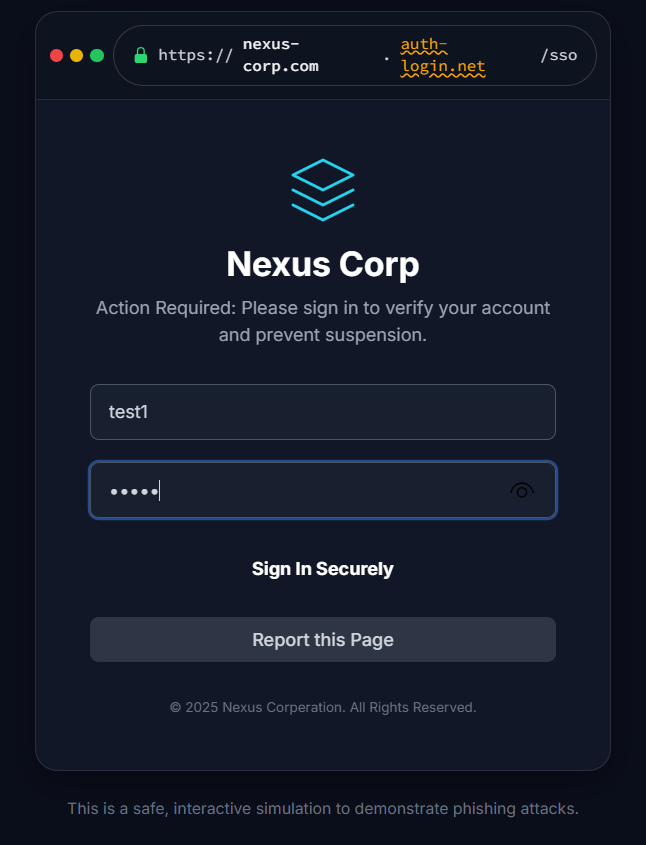
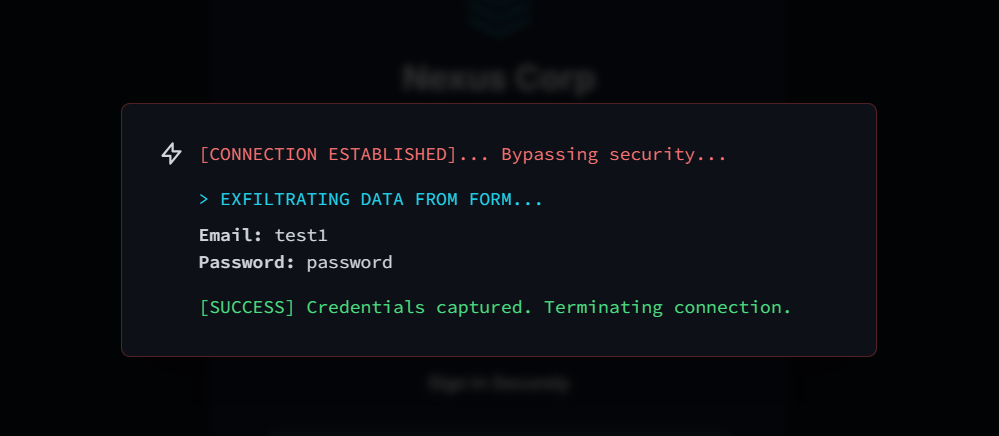
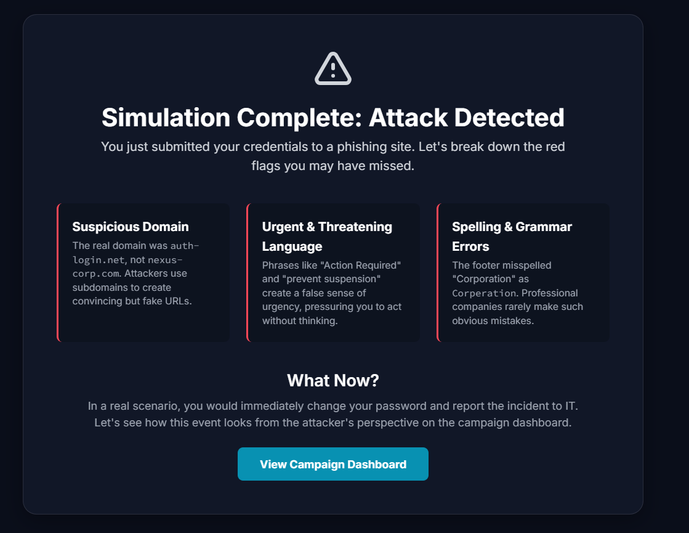
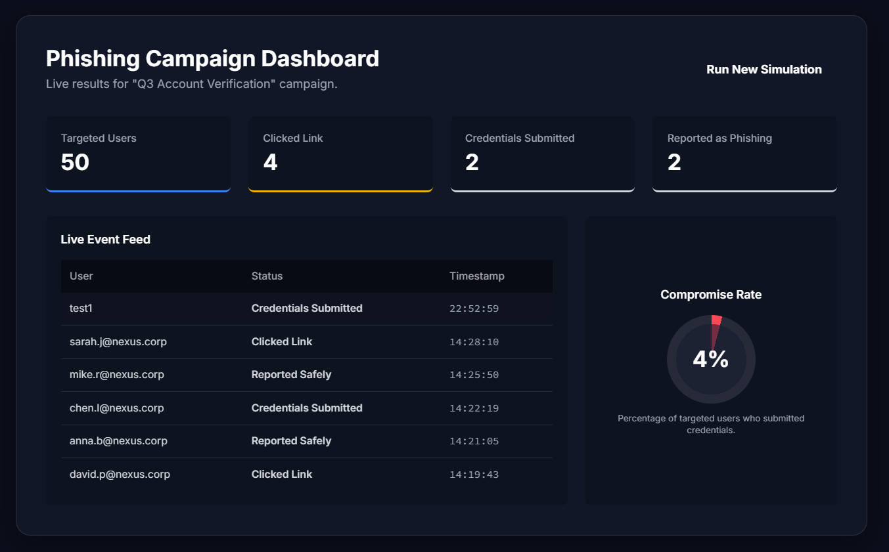

# 🎣 Phishing Awareness & Detection Platform


**Phishing Awareness & Detection Platform** is an **interactive, single-page web application** that simulates phishing attacks, educates users on red flags, and provides an interactive campaign dashboard.

It is a **safe, hands-on learning environment** to understand phishing attack mechanics and defensive measures.

---

## 📑 Table of Contents

* [Live Demo](#-live-demo)
* [Screenshots](#-screenshots)
* [Key Features](#-key-features)
* [Project Structure](#-project-structure)
* [Getting Started](#-getting-started)
* [Technologies Used](#-technologies-used)
* [Core Concepts & Skills](#-core-concepts--skills-demonstrated)
* [Future Enhancements](#-future-enhancements)
* [Licence](#-licence)

---

## 🌐 Live Demo

🔗 **[Try the Live Demo](https://sanilpanchal23.github.io/Phishing-Awareness-Detection-Platform/)**

---


## 📸 Screenshots

| Malicious Login Page                       | Credential Theft                                 | Educational Debrief                                   | Campaign Dashboard                            |
| ------------------------------------------ | ------------------------------------------------ | ----------------------------------------------------- | --------------------------------------------- |
|  |  |  |  |


## ✨ Key Features

* **🎣 Realistic Phishing Simulation** – Fake corporate login page with deceptive URL and browser UI
* **🔓 Immediate Feedback** – Real-time credential theft animation
* **📘 Educational Debrief** – Explains phishing red flags: spelling errors, URL tricks, urgency
* **📊 Campaign Dashboard** – Visualises KPIs: compromise rates, live activity feed
* **✅ Fully Self-contained** – Runs entirely in a single static file

---

## 📂 Project Structure

```text
.
├── index.html        # Main simulation (UI + logic)
├── tailwind.css      # Styling via CDN
├── assets/           # Screenshots and UI assets
│   ├── screenshot-dashboard.png
│   ├── screenshot-login.png
│   ├── screenshot-theft.png
│   ├── screenshot-debrief.png
└── README.md         # Project documentation
```

All logic is contained in `index.html`. TailwindCSS and Google Fonts are loaded via CDN.

---

## 🚀 Getting Started

### 1. Clone the repo

```bash
git clone https://github.com/Sanilpanchal23/Phishing-Awareness-Detection-Platform.git
cd phishing-awareness-platform
```

### 2. Open in browser

```bash
index.html
```

💡 Use a **live server** for best results.

---

## 🛠️ Technologies Used

* **HTML5** – Structure and content
* **Tailwind CSS** – Utility-first, responsive styling
* **JavaScript (ES6+)** – Simulation logic and state management
* **Google Fonts & SVG Icons** – Typography and interface elements

---

## 📚 Core Concepts & Skills Demonstrated

### 🔐 Cybersecurity Awareness

* Social Engineering – Urgency, authority, fear manipulation
* Phishing Analysis – Spotting spoofed domains, spelling errors
* Threat Visualisation – Making cyber risks tangible
* Security Education – Improve organisational security posture

### 🎨 Frontend Development & UX

* DOM Manipulation – Seamless navigation without reloads
* State Management – Track user actions dynamically
* Animations – Smooth CSS transitions and credential theft visualisation
* Responsive Design – Desktop, tablet, and mobile optimisation
* User Journey Mapping – Logical flow from bait → decision → lesson → dashboard

---

## 🌟 Future Enhancements

* Multiple Campaign Templates – Parcel delivery, HMRC tax rebate, corporate alerts
* User Scoring System – Gamified training with scores & leaderboards
* Backend Integration – Persist results with Node.js + PostgreSQL
* Dark/Light Mode Toggle – User-friendly theme switching
* Advanced Analytics – More KPIs, charts, and historical trends

---

## 📜 Licence

MIT Licence © 2025 **\[Sanil Panchal]**

---

✨ **Phishing Awareness & Detection Platform – Safe, Interactive, Hands-On Cybersecurity Learning.**

